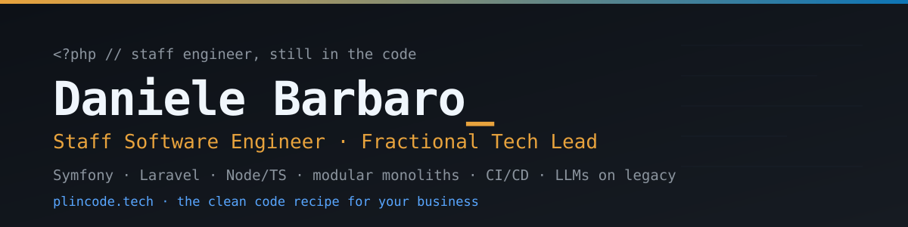

  

<h1 align="center">Hi 👋, I'm Daniele, aka Barbi</h1>

  Staff Software Engineer and Fractional Tech Lead. 
  I own the architecture end to end and stay in the code. 
  PHP, Symfony and Laravel are home ground. Node and TypeScript are the other half of the job. 
  I would rather keep a modular monolith than distribute a system before it needs it.

  <a href="https://plincode.tech">Plin Code</a> ·
  <a href="https://daniele.barbaro.online">daniele.barbaro.online</a> ·
  <a href="https://linkedin.com/in/barbarodaniele">LinkedIn</a> ·
  <a href="https://medium.com/@daniele.barbaro">Medium</a> ·
  <a href="mailto:barbaro.daniele+github@gmail.com">Mail</a>

  

## What I do

- 🏗️ Architecture when a codebase hits its limits. Splitting a large Symfony monolith into explicit bounded contexts, and keeping it a modular monolith instead of jumping to microservices.
- 🚑 Legacy rescue. Testing strategy, code review and a definition of done that make refactoring safe. CI/CD, Docker and Ansible so local, staging and production stop drifting apart.
- 🤖 AI on legacy code. LLM assisted dependency mapping, refactors done one module at a time, and security audits of software written with AI.
- 🧑‍🏫 Teaching and community. Co-organizer of PUG Torino, speaker at Laravel Day 2025, former Node.js teacher at ITS.

## How I work

Boring technology. Explicit boundaries. Tests before refactors. And no architectural decision that nobody on the team can explain.

## Open source

| Package | What it does |
| --- | --- |
| [danielebarbaro/laravel-vat-eu-validator](https://github.com/danielebarbaro/laravel-vat-eu-validator) | EU VAT number validation against the VIES database |
| [plin-code/laravel-istat-geography](https://github.com/plin-code/laravel-istat-geography) | Italian regions, provinces and municipalities from ISTAT data |
| [plin-code/laravel-clean-architecture](https://github.com/plin-code/laravel-clean-architecture) | Generates a clean architecture structure in a Laravel app |
| [plin-code/laravel-istat-foreign-countries](https://github.com/plin-code/laravel-istat-foreign-countries) | ISTAT continents, areas, states and territories with ISO codes |
| [plin-code/laravel-email-fixer](https://github.com/plin-code/laravel-email-fixer) | Normalizes and auto corrects malformed email addresses before validation |
| [plin-code/laravel-full-name](https://github.com/plin-code/laravel-full-name) | Search and sort Eloquent queries and Filament tables by full name |

Everything else lives on Packagist, under [plin-code](https://packagist.org/packages/plin-code/) and [danielebarbaro](https://packagist.org/packages/danielebarbaro/).

## Stack I actually ship with

  &nbsp;
  &nbsp;
  &nbsp;
  &nbsp;
  &nbsp;
  &nbsp;
  &nbsp;
  &nbsp;
  &nbsp;
  &nbsp;
  &nbsp;
  &nbsp;
  &nbsp;
  &nbsp;
  &nbsp;
  

## Writing

<!-- BLOG-POST-LIST:START -->
<ul>
  <li><a href="https://medium.com/@daniele.barbaro/i-deleted-589-lines-of-my-own-static-analysis-50cddd2d9264">I Deleted 589 Lines of My Own Static Analysis</a></li>
  <li><a href="https://medium.com/@daniele.barbaro/extracting-a-working-feature-into-a-laravel-package-f350eb3abd12">Extracting a Working Feature into a Laravel Package</a></li>
  <li><a href="https://medium.com/@daniele.barbaro/a-year-of-hexagonal-architecture-in-laravel-what-worked-what-didnt-and-what-i-shipped-542257415d8a">A Year of Hexagonal Architecture in Laravel: What Worked, What Didn't, and What I Shipped</a></li>
  <li><a href="https://medium.com/@daniele.barbaro/symfony-vs-laravel-everything-you-need-to-know-for-your-next-php-interview-4da0eb5d8526">Symfony vs Laravel: Everything You Need to Know for Your Next PHP Interview</a></li>
  <li><a href="https://medium.com/@daniele.barbaro/lessons-hidden-behind-a-failed-interview-a623f3e22c1a">Lessons Hidden Behind a Failed Interview</a></li>
  <li><a href="https://medium.com/@daniele.barbaro/when-effort-meets-indifference-my-journey-through-job-rejections-ca4081bfce57">When Effort Meets Indifference: My Journey Through Job Rejections</a></li>
  <li><a href="https://medium.com/@daniele.barbaro/the-art-of-laziness-easy-ci-cd-d881bbf77bd7">The Art of Laziness, Easy CI/CD</a></li>
  <li><a href="https://medium.com/@daniele.barbaro/why-i-will-block-you-on-whatsapp-3c6f4f8eb3dd">Why I will block you on WhatsApp.</a></li>
  <li><a href="https://medium.com/@daniele.barbaro/static-config-variables-on-a-laravel-project-4e3650b60670">Static config variables on a Laravel project</a></li>
  <li><a href="https://medium.com/@daniele.barbaro/a-quick-and-dirty-continuous-delivery-for-a-nestjs-application-on-digitalocean-with-gitlab-cd-48769db76d80">A quick and dirty Continuous Delivery for a NestJs Application on DigitalOcean with Gitlab CD</a></li>
</ul>
<!-- BLOG-POST-LIST:END -->

More on [Medium](https://medium.com/@daniele.barbaro).

## GitHub stats

&nbsp;

 

Off keyboard: hiking boots, a motorbike, and a sourdough starter that needs more attention than most microservices. There are a few hidden pages on <a href="https://daniele.barbaro.online/">my site</a>, and at worst you will learn <a href="https://daniele.barbaro.online/contents/hamburger">how to make a burger</a>.
